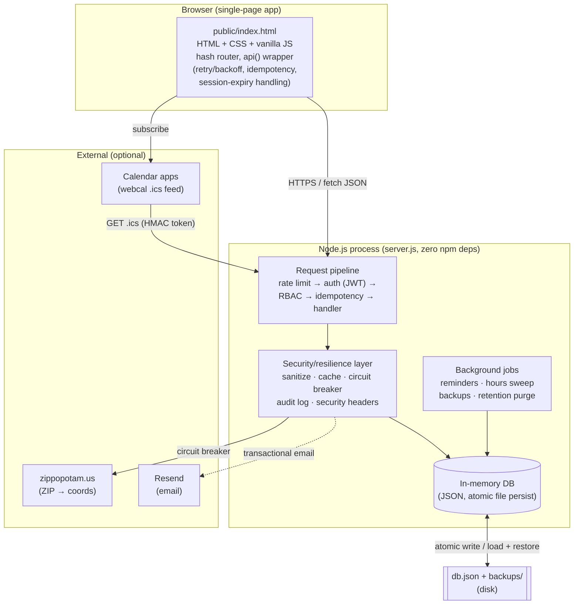

# ServeLocal — Architecture

ServeLocal connects students with vetted community-service opportunities. Students use it
free forever; revenue comes from organization Pro plans and community donations.

## System overview

## Components

| Layer | File | Responsibility |
|---|---|---|
| SPA | `public/index.html` | Entire frontend: views, hash routing, resilient `api()` client, accessibility |
| HTTP server | `server.js` | Routing, auth, RBAC, all business logic, persistence, background jobs |
| Persistence | `db.json` (+ `backups/`) | Single JSON document loaded into memory; atomic temp-file + rename writes |
| Tests | `test/` | `unit`, `integration` (in-process HTTP), `regression` via Node's built-in runner |
| Ops scripts | `scripts/` | `loadtest`, `chaos`, `backup`, `restore` (all zero-dependency) |
| CI | `.github/workflows/ci.yml` | Tests (Node 20/22), coverage floor, chaos, `npm audit` |

## Request lifecycle

1. **Rate limit** — per-IP token bucket (tighter for writes). 429 + `Retry-After` when exceeded.
2. **Body parse** — 1 MB cap, JSON.
3. **Auth** — `Authorization: Bearer <JWT>`; HMAC-verified; `tokenVersion` checked for revocation.
4. **Idempotency** — for mutating requests carrying `Idempotency-Key`, replay the prior response.
5. **Handler** — validates/sanitizes input, enforces role + tenant ownership, mutates the in-memory DB.
6. **Persist** — `saveDB()` writes atomically (temp + rename) and invalidates read caches.
7. **Audit** — security-relevant actions append a hash-chained entry.
8. **Respond** — JSON with security headers (CSP, HSTS in prod, anti-clickjacking, nosniff).

## Key design decisions

See the Architecture Decision Records in [`docs/adr/`](./adr/). Highlights:

- **ADR-0001** Zero npm runtime dependencies (auditable, tiny attack surface).
- **ADR-0002** JSON-file database with atomic writes + snapshots (right-sized for current scale).
- **ADR-0003** Stateless HMAC JWT auth with `tokenVersion` revocation.
- **ADR-0004** Demo-mode billing until Stripe is wired (see `DEPLOY.txt` §9).
- **ADR-0005** Hash-chained, tamper-evident audit log.
- **ADR-0006** In-memory token-bucket rate limiting + circuit breaker for external calls.
- **ADR-0007** CSP retains `unsafe-inline` for the intentionally inline-everything SPA.
- **ADR-0008** Coarse cache invalidation: every write bumps a global cache version.

## Scaling notes (known limits)

The JSON-file/in-memory model is single-node and fits the current scale. The migration path
(documented in `DEPLOY.txt` and ADR-0002) is: move `db.json` onto a persistent volume, then to
Postgres when write contention or dataset size demands it. The persistence layer is isolated to
`loadDB`/`saveDB`, so swapping the backend is contained.
